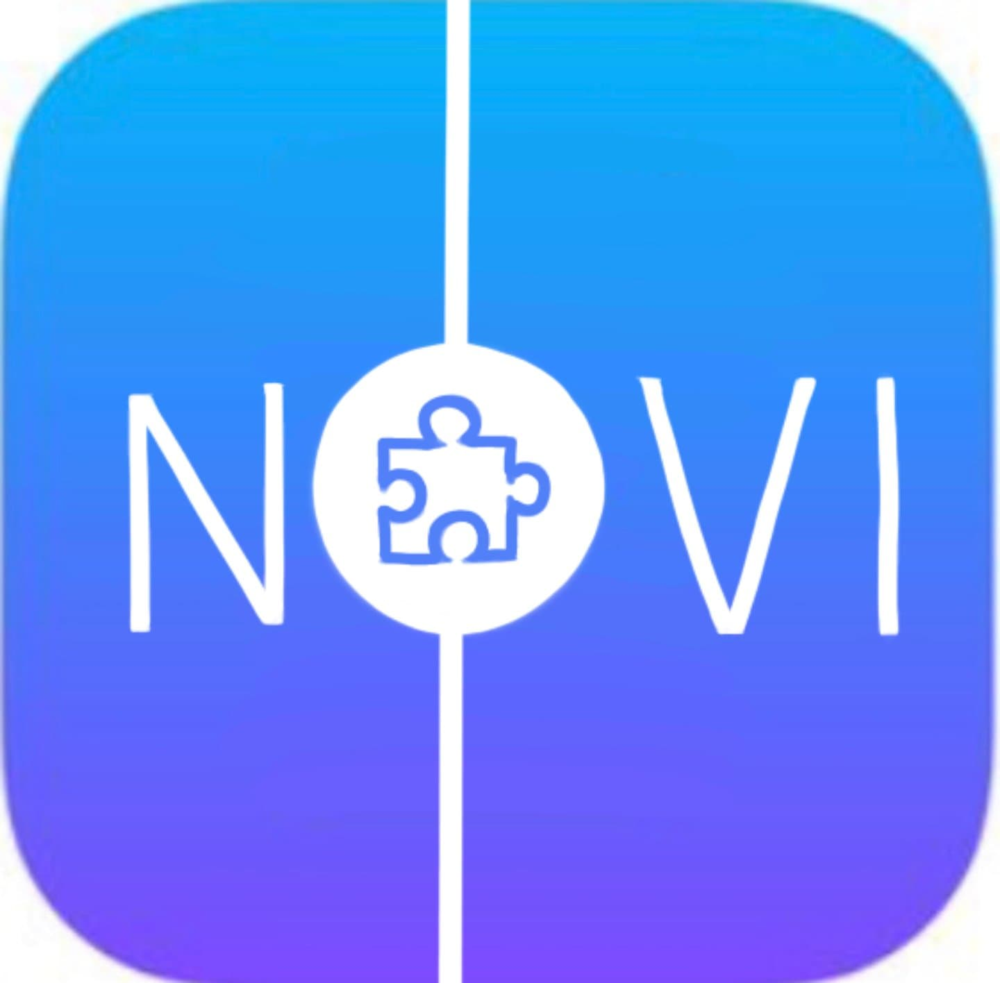

{:height="400px" width="400px"}
## Inspiration
Since the arrival of text messaging into the modern day world, users have had a love hate relationship with this novel form of communication. Instant contact with those you love at the cost of losing an entire facet of conversation - emotion. However, one group of individuals has been affected by this more than most. For those with autism, who already have a difficult time navigating emotional cues in person, the world of text messages is an even more challenging situation. That's where NOVI comes in. 

## What it does
NOVI utilizes Natural Language Processing to identify a range of emotions within text messages from user to user. Then, by using visual and text cues and an intuitive UI/UX design, it informs the user (based on their learning preferences) of what emotions can be found in the texts they are receiving. NOVI is a fully functional app with a back-end utilizing machine learning and a heavily researched front end to cater to our demographic and help them as much as possible. 

## How I built it
Through the use of react native, CSS, javascript, Google Cloud and plenty of hours, NOVI was born. We focused on a back end implementation with a weight on machine learning and natural language processing and a front end focus on research based intuition that could maximize the effectiveness of our app for our users. We ended up with a brand new fully functional messaging app that caters to our demographic's exact needs.

## Challenges I ran into
As this was many of our first times touching anything related to machine learning, there was no real intuition behind a lot of the things we tried to implement. This meant a lot of learning potential and many hours poured into developing new skills. By the end of it however we ended up learning a lot about not only new topics, but also the process of discovering new information and content in order to create our own products.

## Accomplishments that I'm proud of
Something we put a genuinely large amount of effort into was researching our target demographic. As every member in our group had very individual experiences with someone with autism, there were a lot of assumptions we had to avoid making. We avoided these generalizations by looking into as many research papers backing our theories as we could find. This was the extra step we chose to take to assure a genuinely effective UI/UX for our users. 

## What I learned
We learned how to use react native, how to use a backend and among many other things, simply how to learn new things. We learned how to research to maximize effectiveness of interfaces and experiences and we learned how to make an app with a specific user base. 

## What's next for NOVI 
NOVI is an app with much to offer and a lot of potential for collaboration with a variety of organizations and other companies. It is also possible to adapt the concept of NOVI to adapt to other areas of aid for other possible demographics, such as for those with Asperger's.
